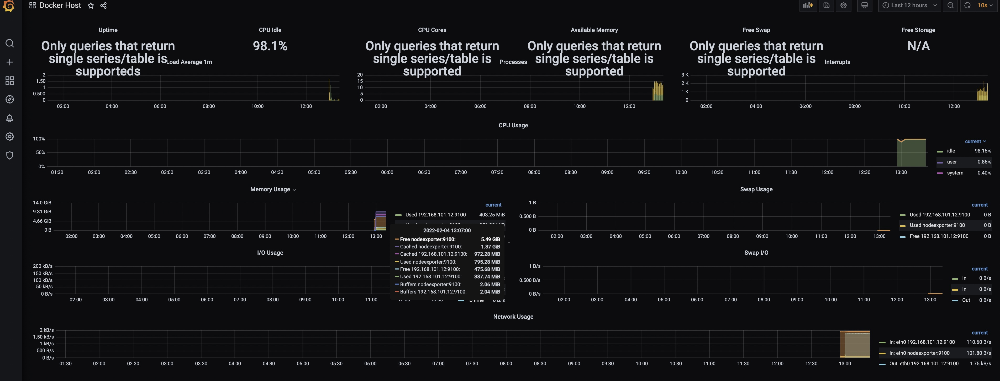

### Домашнее задание к занятию "5.4. Оркестрация группой Docker контейнеров на примере Docker Compose"

### Задача 1

Создать собственный образ операционной системы с помощью Packer.

Для получения зачета, вам необходимо предоставить:
- Скриншот страницы, как на слайде из презентации (слайд 37).


### Задача 2

Создать вашу первую виртуальную машину в Яндекс.Облаке.

Для получения зачета, вам необходимо предоставить:
- Скриншот страницы свойств созданной ВМ:


### Задача 3

Создать ваш первый готовый к боевой эксплуатации компонент мониторинга, состоящий из стека микросервисов.

Для получения зачета, вам необходимо предоставить:
- Скриншот работающего веб-интерфейса Grafana с текущими метриками:


### Задача 4 (*)

Создать вторую ВМ и подключить её к мониторингу развёрнутому на первом сервере.

Для получения зачета, вам необходимо предоставить:
- Скриншот из Grafana, на котором будут отображаться метрики добавленного вами сервера.


Создаем node02.tf по аналогии с node01.tf, добавив ip
```
  network_interface {
    ....
    ....
    ip_address = "192.168.101.12"
  }
```
Добавляем в inventory
```
....
[monitoring:children]
machines

[machines]
node02.netology.cloud ansible_host=-----ip_node2-----
```
Создаем exporters/docker-compose.exporters.yml по аналогии с node01   
Создаем docker-compose.yml с секциями nodeexporter и cadvisor  
Создаем add_nodes.yml по аналогии с provision.yml  
Добавляем node02 - ansible-playbook add_nodes.yml  
В Grafana на дашбордах в Metrics-Legend добавляем {{instance}}