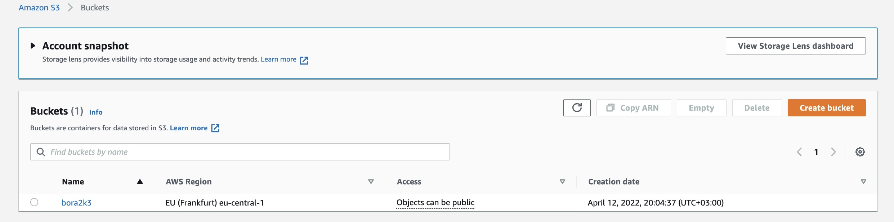
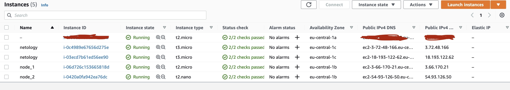

### Домашнее задание к занятию "7.3. Основы и принцип работы Терраформ"

#### Задача 1. Создадим бэкэнд в S3 (необязательно, но крайне желательно).

Если в рамках предыдущего задания у вас уже есть аккаунт AWS, то давайте продолжим знакомство со взаимодействием
терраформа и aws. 

1. Создайте s3 бакет, iam роль и пользователя от которого будет работать терраформ. Можно создать отдельного пользователя,
а можно использовать созданного в рамках предыдущего задания, просто добавьте ему необходимы права, как описано 
[здесь](https://www.terraform.io/docs/backends/types/s3.html).
2. Зарегистрируйте бэкэнд в терраформ проекте как описано по ссылке выше. 
```bash
% aws s3api create-bucket \
    --bucket bora2k3 \
    --region eu-central-1 \
    --object-ownership BucketOwnerEnforced \
    --create-bucket-configuration LocationConstraint=eu-central-1
```
```bash
{
    "Location": "http://bora2k3.s3.amazonaws.com/"
}
```
```bash
% aws dynamodb create-table \
    --table-name terraform_state \
    --attribute-definitions AttributeName=LockID,AttributeType=S \
    --key-schema AttributeName=LockID,KeyType=HASH \
    --provisioned-throughput ReadCapacityUnits=5,WriteCapacityUnits=5
```
```bash
{
    "TableDescription": {
        "AttributeDefinitions": [
            {
                "AttributeName": "LockID",
                "AttributeType": "S"
            }
        ],
        "TableName": "terraform_state",
        "KeySchema": [
            {
                "AttributeName": "LockID",
                "KeyType": "HASH"
            }
        ],
        "TableStatus": "CREATING",
        "CreationDateTime": "2022-04-12T20:08:00.316000+03:00",
        "ProvisionedThroughput": {
            "NumberOfDecreasesToday": 0,
            "ReadCapacityUnits": 5,
            "WriteCapacityUnits": 5
        },
        "TableSizeBytes": 0,
        "ItemCount": 0,
        "TableArn": "arn:aws:dynamodb:eu-central-1:341635784912:table/terraform_state",
        "TableId": "896caa29-5c3b-4e03-a984-b4a9b82d5606"
:...skipping...
{
    "TableDescription": {
        "AttributeDefinitions": [
            {
                "AttributeName": "LockID",
                "AttributeType": "S"
            }
        ],
        "TableName": "terraform_state",
        "KeySchema": [
            {
                "AttributeName": "LockID",
                "KeyType": "HASH"
            }
        ],
        "TableStatus": "CREATING",
        "CreationDateTime": "2022-04-12T20:08:00.316000+03:00",
        "ProvisionedThroughput": {
            "NumberOfDecreasesToday": 0,
            "ReadCapacityUnits": 5,
            "WriteCapacityUnits": 5
        },
        "TableSizeBytes": 0,
        "ItemCount": 0,
        "TableArn": "arn:aws:dynamodb:eu-central-1:341635784912:table/terraform_state",
        "TableId": "896caa29-5c3b-4e03-a984-b4a9b82d5606"
    }
}
```
```bash
% aws s3 ls
2022-04-12 20:04:38 bora2k3
```


#### Задача 2. Инициализируем проект и создаем воркспейсы.

1. Выполните `terraform init`:
    * если был создан бэкэнд в S3, то терраформ создаст файл стейтов в S3 и запись в таблице 
dynamodb.
    * иначе будет создан локальный файл со стейтами.  
2. Создайте два воркспейса `stage` и `prod`.
3. В уже созданный `aws_instance` добавьте зависимость типа инстанса от вокспейса, что бы в разных ворскспейсах 
использовались разные `instance_type`.
4. Добавим `count`. Для `stage` должен создаться один экземпляр `ec2`, а для `prod` два. 
5. Создайте рядом еще один `aws_instance`, но теперь определите их количество при помощи `for_each`, а не `count`.
6. Что бы при изменении типа инстанса не возникло ситуации, когда не будет ни одного инстанса добавьте параметр
жизненного цикла `create_before_destroy = true` в один из ресурсов `aws_instance`.
7. При желании поэкспериментируйте с другими параметрами и ресурсами.

В виде результата работы пришлите:
* Вывод команды `terraform workspace list`.
* Вывод команды `terraform plan` для воркспейса `prod`.
```bash
% terraform workspace new stage
Created and switched to workspace "stage"!

You're now on a new, empty workspace. Workspaces isolate their state,
so if you run "terraform plan" Terraform will not see any existing state
for this configuration.
```
```bash
% terraform workspace new prod
Created and switched to workspace "prod"!

You're now on a new, empty workspace. Workspaces isolate their state,
so if you run "terraform plan" Terraform will not see any existing state
for this configuration.
```
```bash
% terraform workspace list
  default
* prod
  stage
```


[terraform config files](https://github.com/Bora2k3/devops-netology/tree/main/terraform/07-terraform-03-basic)
```bash
% terraform plan -no-color > plan_output.txt
```
[terraform plan output](terraform/07-terraform-03-basic/plan_output.txt)