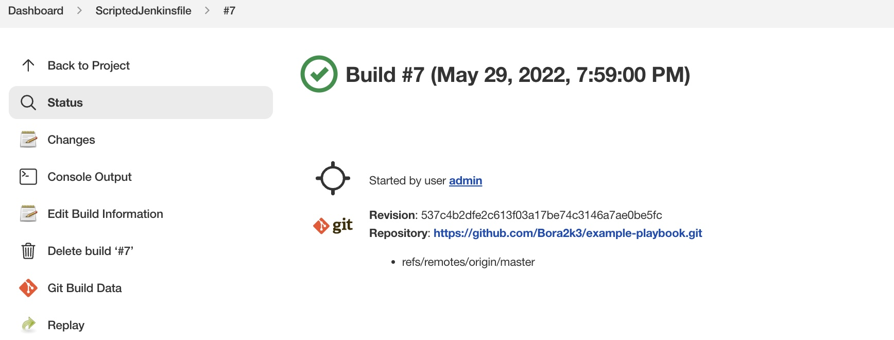

### Домашнее задание к занятию "09.03 Jenkins"

#### Подготовка к выполнению

1. Установить jenkins по любой из [инструкций](https://www.jenkins.io/download/)
```yaml
version: '3.8'
services:
  jenkins:
    image: jenkins/jenkins:latest-jdk11
    privileged: true
    user: root
    ports:
      - 8080:8080
      - 50000:50000
    container_name: jenkins
    volumes:
      - $HOME/jenkins_compose/jenkins_configuration:/var/jenkins_home
      - /var/run/docker.sock:/var/run/docker.sock
```
2. Запустить и проверить работоспособность
```bash
$ docker-compose up -d
$ docker-compose ps
NAME                COMMAND                  SERVICE             STATUS              PORTS
jenkins             "/sbin/tini -- /usr/…"   jenkins             running             0.0.0.0:8080->8080/tcp, 0.0.0.0:50000->50000/tcp, :::8080->8080/tcp, :::50000->50000/tcp
$ docker exec jenkins cat /var/jenkins_home/secrets/initialAdminPassword
f27d88xxxxxxxxxxxxxxxxxxxx4e2e75
```
3. Сделать первоначальную настройку
4. Настроить под свои нужды
5. Поднять отдельный cloud


6. Для динамических агентов можно использовать [образ](https://hub.docker.com/repository/docker/aragast/agent)
7. Обязательный параметр: поставить label для динамических агентов: `ansible_docker`
8. Сделать форк репозитория с [playbook](https://github.com/aragastmatb/example-playbook)

#### Основная часть

1. Сделать Freestyle Job, который будет запускать `ansible-playbook` из форка репозитория


```bash
PLAY RECAP *********************************************************************
localhost                  : ok=5    changed=4    unreachable=0    failed=0    skipped=1    rescued=0    ignored=0   

Finished: SUCCESS
```
2. Сделать Declarative Pipeline, который будет выкачивать репозиторий с плейбукой и запускать её


```bash
PLAY RECAP *********************************************************************
localhost                  : ok=5    changed=4    unreachable=0    failed=0    skipped=1    rescued=0    ignored=0   

[Pipeline] }
[Pipeline] // stage
[Pipeline] }
[Pipeline] // node
[Pipeline] End of Pipeline
Finished: SUCCESS
```
3. Перенести Declarative Pipeline в репозиторий в файл `Jenkinsfile`
```bash
Изменил содержимое Jenkinsfile в репозитории
```
```bash
pipeline {
    agent {
        label "ansible_docker"
    }

    stages {
        stage('prepare_node') {
            steps {
                git 'https://github.com/Bora2k3/example-playbook.git'
                sh 'ansible-vault decrypt secret --vault-password-file vault_pass'
                sh 'mkdir ~/.ssh/ && mv ./secret ~/.ssh/id_rsa && chmod 400 ~/.ssh/id_rsa'
                sh 'ansible-galaxy install -r requirements.yml -p roles'
                sh 'ansible-playbook site.yml -i inventory/prod.yml'
            }
        }
    }
}
```
4. Перенастроить Job на использование `Jenkinsfile` из репозитория

```bash
PLAY RECAP *********************************************************************
localhost                  : ok=5    changed=4    unreachable=0    failed=0    skipped=1    rescued=0    ignored=0   

[Pipeline] }
[Pipeline] // stage
[Pipeline] }
[Pipeline] // withEnv
[Pipeline] }
[Pipeline] // node
[Pipeline] End of Pipeline
Finished: SUCCESS
```
5. Создать Scripted Pipeline, наполнить его скриптом из [pipeline](./pipeline)
6. Заменить credentialsId на свой собственный
7. Проверить работоспособность, исправить ошибки, исправленный Pipeline вложить в репозитрий в файл `ScriptedJenkinsfile`

```bash
PLAY RECAP *********************************************************************
localhost                  : ok=5    changed=4    unreachable=0    failed=0    skipped=1    rescued=0    ignored=0   

[Pipeline] }
[Pipeline] // stage
[Pipeline] }
[Pipeline] // node
[Pipeline] End of Pipeline
Finished: SUCCESS
```
8. Отправить ссылку на репозиторий в ответе  
[https://github.com/Bora2k3/example-playbook](https://github.com/Bora2k3/example-playbook)

#### Необязательная часть

1. Создать скрипт на groovy, который будет собирать все Job, которые завершились хотя бы раз неуспешно. Добавить скрипт в репозиторий с решеним с названием `AllJobFailure.groovy`
2. Установить customtools plugin
3. Поднять инстанс с локальным nexus, выложить туда в анонимный доступ  .tar.gz с `ansible`  версии 2.9.x
4. Создать джобу, которая будет использовать `ansible` из `customtool`
5. Джоба должна просто исполнять команду `ansible --version`, в ответ прислать лог исполнения джобы