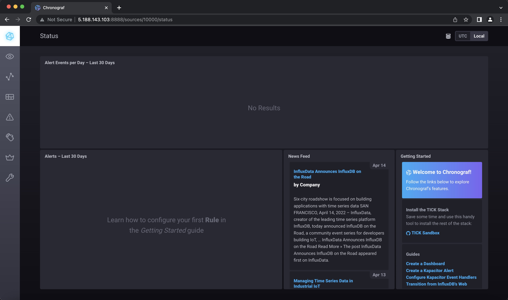
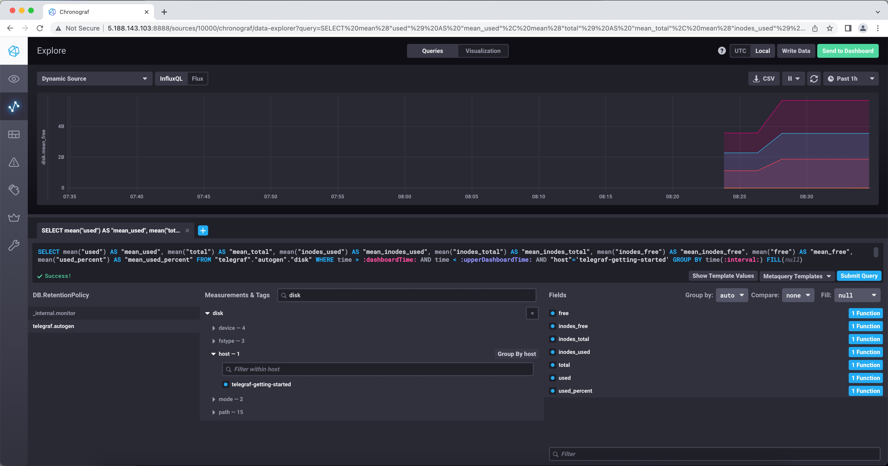
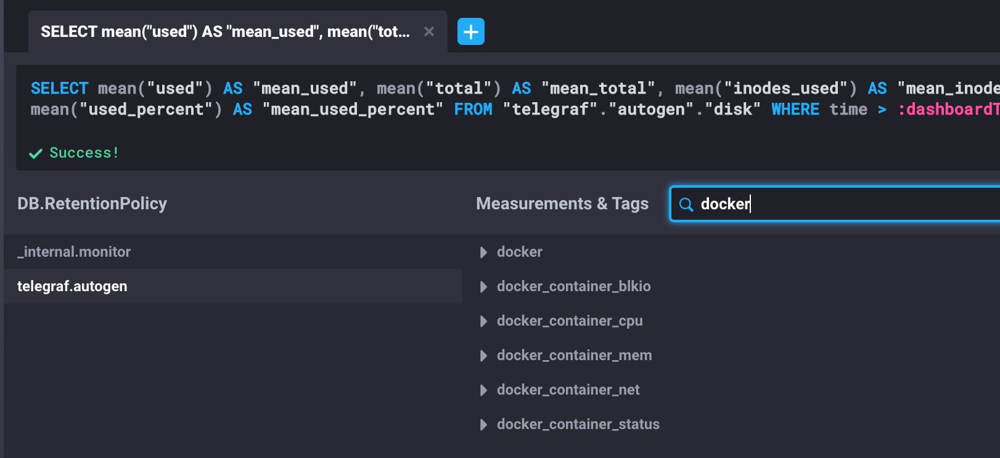

### Домашнее задание к занятию "10.02. Системы мониторинга"

#### Обязательные задания

1. Опишите основные плюсы и минусы pull и push систем мониторинга.

2. Какие из ниже перечисленных систем относятся к push модели, а какие к pull? А может есть гибридные?

    - Prometheus 
    - TICK
    - Zabbix
    - VictoriaMetrics
    - Nagios

3. Склонируйте себе [репозиторий](https://github.com/influxdata/sandbox/tree/master) и запустите TICK-стэк, 
используя технологии docker и docker-compose.

В виде решения на это упражнение приведите выводы команд с вашего компьютера (виртуальной машины):

    - curl http://localhost:8086/ping
```bash
$ curl -Is http://localhost:8086/ping
HTTP/1.1 204 No Content
Content-Type: application/json
Request-Id: f78d5432-bc26-11ec-8239-0242ac120002
X-Influxdb-Build: OSS
X-Influxdb-Version: 1.8.10
X-Request-Id: f78d5432-bc26-11ec-8239-0242ac120002
Date: Thu, 14 Apr 2022 19:13:28 GMT
```
    - curl http://localhost:8888
```bash
$ curl http://localhost:8888
<!DOCTYPE html><html><head><meta http-equiv="Content-type" content="text/html; charset=utf-8"><title>Chronograf</title><link rel="icon shortcut" href="/favicon.fa749080.ico"><link rel="stylesheet" href="/src.9cea3e4e.css"></head><body> <div id="react-root" data-basepath=""></div> <script src="/src.a969287c.js"></script> </body></html>
```
    - curl http://localhost:9092/kapacitor/v1/ping
```bash
$ curl -Is http://localhost:9092/kapacitor/v1/ping
HTTP/1.1 204 No Content
Content-Type: application/json; charset=utf-8
Request-Id: 4f6440c0-bc27-11ec-8267-000000000000
X-Kapacitor-Version: 1.6.4
Date: Thu, 14 Apr 2022 19:15:56 GMT
```

А также скриншот веб-интерфейса ПО chronograf (`http://localhost:8888`). 



P.S.: если при запуске некоторые контейнеры будут падать с ошибкой - проставьте им режим `Z`, например
`./data:/var/lib:Z`

4. Перейдите в веб-интерфейс Chronograf (`http://localhost:8888`) и откройте вкладку `Data explorer`.

    - Нажмите на кнопку `Add a query`
    - Изучите вывод интерфейса и выберите БД `telegraf.autogen`
    - В `measurments` выберите mem->host->telegraf_container_id , а в `fields` выберите used_percent. 
    Внизу появится график утилизации оперативной памяти в контейнере telegraf.
    - Вверху вы можете увидеть запрос, аналогичный SQL-синтаксису. 
    Поэкспериментируйте с запросом, попробуйте изменить группировку и интервал наблюдений.

Для выполнения задания приведите скриншот с отображением метрик утилизации места на диске 
(disk->host->telegraf_container_id) из веб-интерфейса. 

Отсутствовали метрики `mem` и `disk`. Добавил в `telegraf.conf`
```bash
 [[inputs.mem]]
  # no configuration

[[inputs.disk]]
  # mount_points = ["/"]
```



5. Изучите список [telegraf inputs](https://github.com/influxdata/telegraf/tree/master/plugins/inputs). 
Добавьте в конфигурацию telegraf следующий плагин - [docker](https://github.com/influxdata/telegraf/tree/master/plugins/inputs/docker):
```
[[inputs.docker]]
  endpoint = "unix:///var/run/docker.sock"
```

Дополнительно вам может потребоваться донастройка контейнера telegraf в `docker-compose.yml` дополнительного volume и 
режима privileged:
```
  telegraf:
    image: telegraf:1.4.0
    privileged: true
    volumes:
      - ./etc/telegraf.conf:/etc/telegraf/telegraf.conf:Z
      - /var/run/docker.sock:/var/run/docker.sock:Z
    links:
      - influxdb
    ports:
      - "8092:8092/udp"
      - "8094:8094"
      - "8125:8125/udp"
```

После настройке перезапустите telegraf, обновите веб интерфейс и приведите скриншотом список `measurments` в 
веб-интерфейсе базы telegraf.autogen . Там должны появиться метрики, связанные с docker.



Факультативно можете изучить какие метрики собирает telegraf после выполнения данного задания.

#### Дополнительное задание (со звездочкой*) - необязательно к выполнению

В веб-интерфейсе откройте вкладку `Dashboards`. Попробуйте создать свой dashboard с отображением:

    - утилизации ЦПУ
    - количества использованного RAM
    - утилизации пространства на дисках
    - количество поднятых контейнеров
    - аптайм
    - ...
    - фантазируйте)